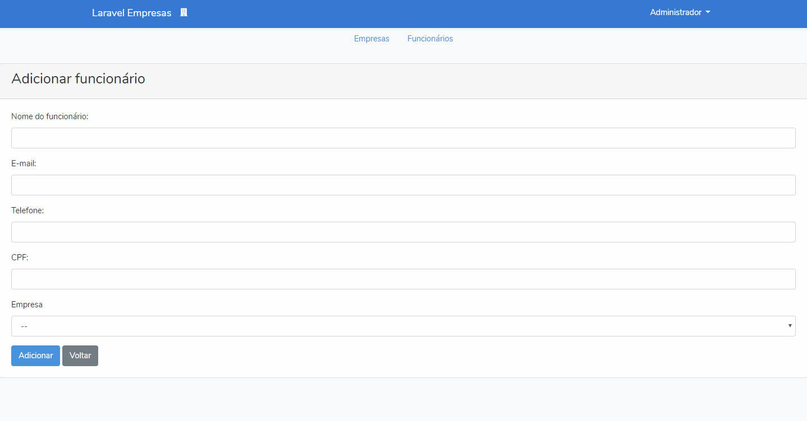

# Introdução

Aplicativo Web desenvolvido com o framework Laravel para administração de empresas e funcionários.

# Sobre o build

O aplicativo foi criado com a utilização das seguintes ferramentas:

Para o backend:
- Laravel;
- Banco de dados MySQL;

Para o frontend:
- Bootstrap;
- HTML5;

# Execução

- Abra o terminal no seu computador no diretório do seu servidor web e digite o seguinte comando:
  
  git clone https://github.com/LuizHonorato/laravel-empresas.git

- Através do terminal, entre na pasta laravel-empresas;

- Digite o comando composer install para instalar as dependências;

- Copie e renomeie o arquivo .env.example para .env na raiz do diretório;

- Configure o arquivo .env com as seguintes configurações:

    APP_NAME='Laravel Empresas'
    
    ...
    
    DB_CONNECTION=mysql
    DB_HOST=127.0.0.1
    DB_PORT=3306
    DB_DATABASE=laravel-empresas
    DB_USERNAME=root
    DB_PASSWORD=''
    
- Observação: As configurações acima podem variar conforme o seu ambiente de desenvolvimento;

- No terminal digite os seguintes comandos:

    php artisan key:generate
    
    php artisan migrate
    
    php artisan db:seed
    
    php artisan storage:link
    
- Após os passos acima digite o comando: php artisan serve;

- Pronto! O aplicativo estará rodando no endereço http://localhost:8000

P.S.: Nas listas de empresas e funcionários, a paginação irá aparecer assim que os itens listados atingirem o limite de 10 registros por página.

# Screenshots

